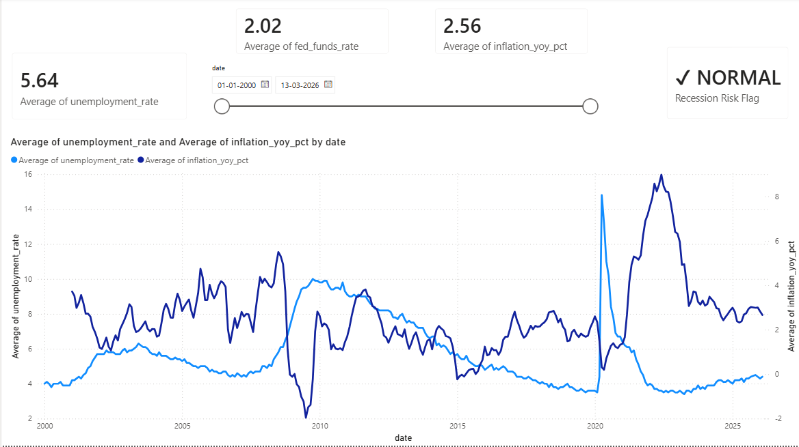
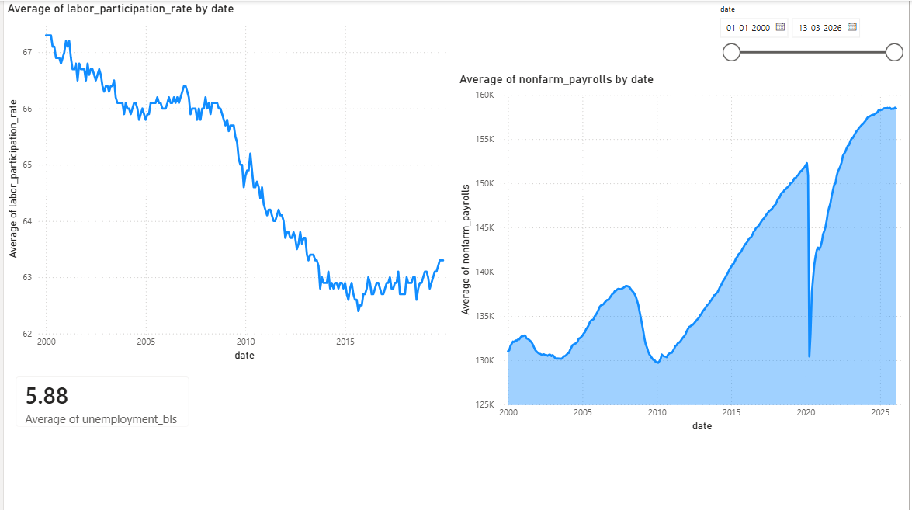
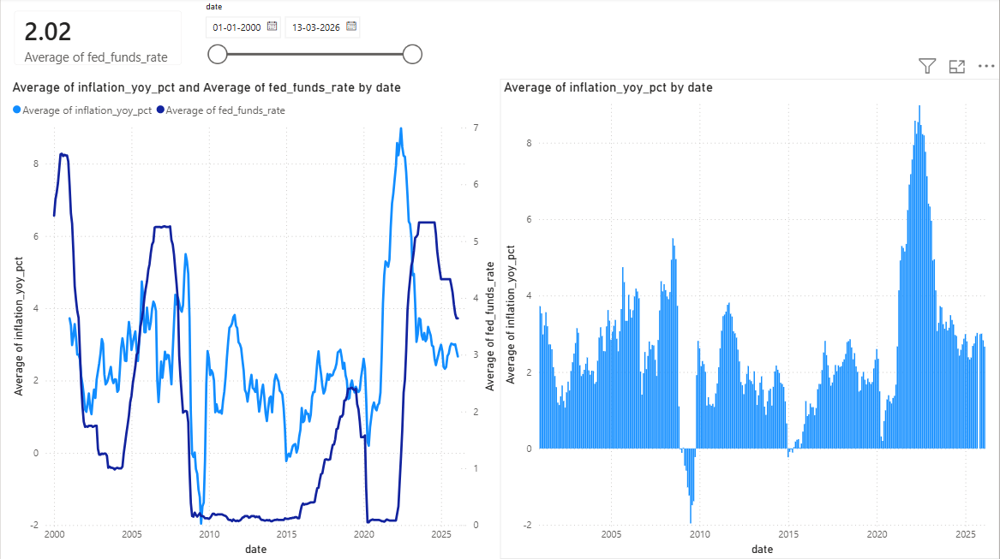
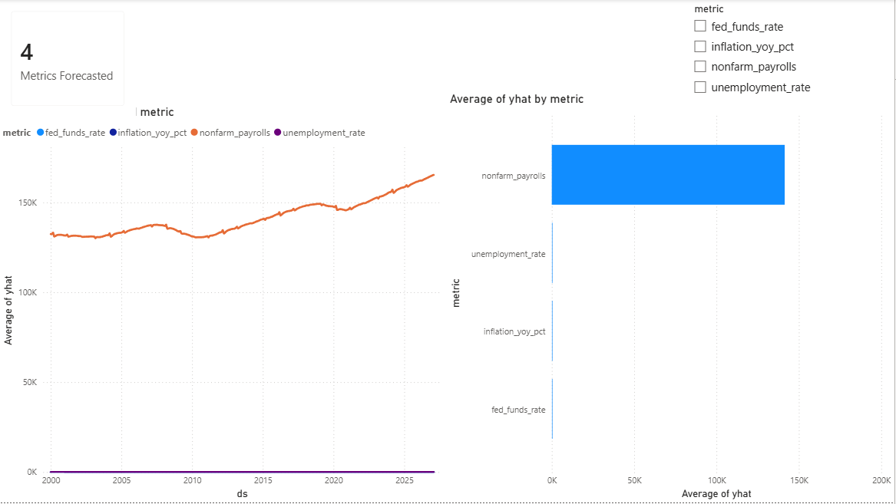

# U.S. Economic Intelligence Dashboard

> A live, auto-refreshing economic analytics platform pulling real-time data
> from the Federal Reserve (FRED) and Bureau of Labor Statistics (BLS) APIs.
> Pipeline runs automatically and updates all forecasts on demand.

## Dashboard Preview





## Live Data Sources
| Source | API | Metrics |
|--------|-----|---------|
| Federal Reserve (FRED) | fred.stlouisfed.org | Unemployment, CPI, GDP, Fed Funds Rate, Nonfarm Payrolls, Yield Spread |
| Bureau of Labor Statistics (BLS) | bls.gov | Employment, Labor Participation Rate |

## Tech Stack
- **Python** — REST API integration, automated pipeline, Prophet forecasting
- **SQL (SQLite)** — schema design, KPI queries, window functions
- **Power BI** — 4-page interactive executive dashboard

## Key Findings (as of March 2026)
- Current unemployment rate: ~4.0% — near historic lows
- Inflation YoY: ~2.56% — approaching Fed's 2% target
- Current Fed Funds Rate: ~4.3% — aggressive tightening cycle visible in data
- Recession risk signal: NORMAL — yield curve no longer inverted
- Labor participation rate declined from 67% (2000) to 63% (2015) and never fully recovered
- Nonfarm payrolls forecast: continued growth to 165K+ through early 2027

## Pipeline Architecture
```
FRED API ──┐
           ├──► transform.py ──► SQLite DB ──► Power BI Dashboard
BLS API ───┘         │
                     └──► forecast.py ──► 12-month Prophet forecast
```

## How to Run
1. Register for free API keys (FRED, BLS)
2. Add keys to `.env` file
3. `python -m pip install -r requirements.txt`
4. `cd pipeline && python run_pipeline.py`
5. Open `powerbi/EconomicDashboard.pbix` in Power BI Desktop